# Automated TED Talk Filtering Pipeline

<!-- Front-page workflow diagram (vector) -->


<!-- PNG fallback for viewers without SVG support -->
<details>
<summary>PNG fallback</summary>


</details>

This project is a fully automated pipeline designed to download, clip, and filter TED Talk videos to create a high-quality collection of single-speaker clips. The pipeline is built to be robust, avoiding duplicates, excluding low-quality content like YouTube Shorts, and ensuring videos do not have hardcoded subtitles.

## Core Features

- **Automated Downloading**: Fetches videos directly from the official TED YouTube channel (`@TED`).
- **Smart Filtering**:
    - Excludes YouTube Shorts (videos shorter than 3 minutes).
    - Skips videos with titles indicating hardcoded subtitles (e.g., "subtitles", "captions").
    - Avoids re-processing speakers that are already in the output collection.
- **Two-Stage Clip Filtering**:
    1.  **Clipping**: Each downloaded video is clipped into 5 segments of 30 seconds each.
    2.  **Person Detection**: Each clip is analyzed to ensure it contains a single speaker. It uses HOG (Histogram of Oriented Gradients) for reliable person detection.
- **Parallel Processing**: The second-stage filtering runs in parallel (up to 4 concurrent processes) to maximize throughput.
- **Continuous Operation**: The main script runs continuously until it collects a target number of filtered videos (currently set to 2000).

## How It Works

The pipeline is orchestrated by `batch_ted_clipper.py` and relies on several other scripts and configuration files.

### 1. Video Search & Download Mechanism

- **File**: `batch_ted_clipper.py`

The process starts by fetching a list of video URLs from the official `@TED` YouTube channel's video page. It uses `yt-dlp` with the `--flat-playlist` option to quickly retrieve a list of video IDs and titles without downloading the full video information, which is much faster.

Once the list is fetched, the script iterates through it. For each video:
1.  **Speaker Name Extraction**: The speaker's name is extracted from the video title.
2.  **Duplicate Check**: It checks if a speaker with the same sanitized name already exists in the `ted_clips_new/` (processing queue) or `filtered_videos_2/` (final output) folders. If a duplicate is found, the video is skipped.
3.  **Download**: The video is downloaded using `yt-dlp`. During this step, another filter is applied (`--match-filter "duration > 180"`) to ensure Shorts are not downloaded. It also prevents subtitle files from being downloaded.

### 2. Clipping and Filtering

- **Main Orchestrator**: `batch_ted_clipper.py`
- **Clipping & Detection Logic**: `tool.py`
- **Per-Speaker Filter Runner**: `process_single_speaker.py`
- **Configuration**: `filter_config.py`

This is a two-stage process:

1.  **Stage 1: Clipping**
    - The downloaded video is passed to `tool.py` to be clipped into 5 segments. These raw clips are saved in a speaker-specific folder inside `ted_clips_new/`.

2.  **Stage 2: Filtering**
    - As soon as clips for a speaker are created, `batch_ted_clipper.py` launches a separate, parallel process using `process_single_speaker.py`.
    - This script runs the HOG person detector on each of the 5 clips for that speaker.
    - It uses the thresholds defined in `filter_config.py` to find the best clip with only one person.
    - If a valid clip is found, it is copied to the final `filtered_videos_2/` directory.

## Key Files in the Project

- `batch_ted_clipper.py`: The main entry point and orchestrator for the entire pipeline.
- `tool.py`: Contains the core logic for video clipping and person detection (both YOLO and HOG).
- `process_single_speaker.py`: A wrapper script that runs the second-stage filtering for a single speaker's folder. This is what allows for parallel processing.
- `filter_config.py`: A configuration file where you can set input/output directories and tune the filtering thresholds.
- `ted_video_filter.py`: The script that contains the filtering logic used by `process_single_speaker.py`.

## How to Use This Project

1.  **Prerequisites**:
    - Python 3
    - FFmpeg installed and available in your system's PATH.
    - Required Python packages: `opencv-python`, `numpy`, `ultralytics`, `yt-dlp`. You can install them with:
      ```bash
      pip install opencv-python numpy ultralytics yt-dlp
      ```

2.  **Configuration**:
    - Open `filter_config.py` to adjust the input (`ted_clips_new`) and output (`filtered_videos_2`) directories if needed.
    - You can also tune the detection thresholds here.

3.  **Run the Pipeline**:
    - Execute the main script from your terminal:
      ```bash
      python batch_ted_clipper.py
      ```

4.  **Monitor Progress**:
    - The script will log its progress to the console.
    - You can monitor the `ted_clips_new/` folder to see the raw clips being created and the `filtered_videos_2/` folder for the final, high-quality filtered clips.